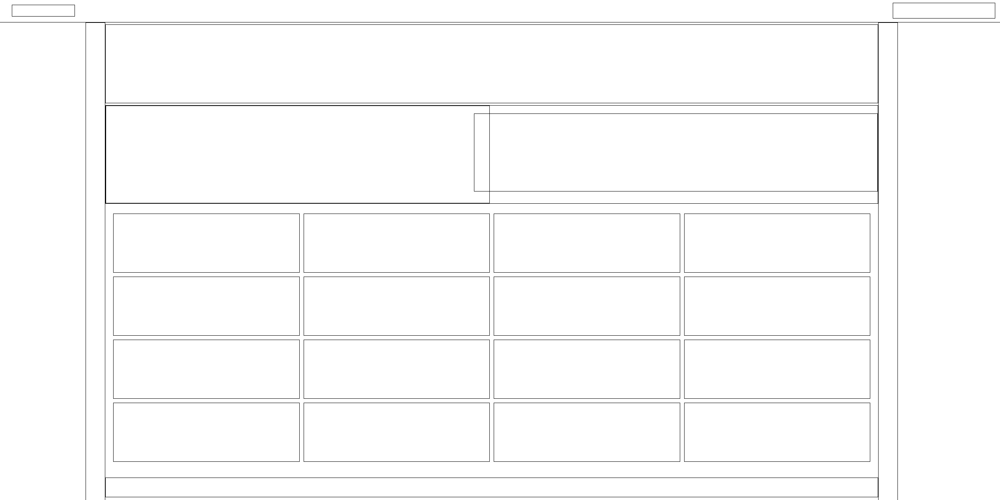

HTML5 Semantiline Veebilehe struktuur
Aluseks võetud veebileht: https://tailwindcss.com/

Eesmärgiks luua veebilehest reageeriv-suurust muutev struktuur leht. 
Sisu ega teksti ei kuvata, ainult kastid elementidest - mis siis paigutuvad automaatselt vastavalt brauseri akna suurusele.
Kasutatud on avalehte. 

Pilt struktuurist:

